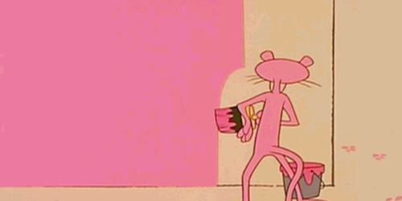

<!-- =========================================================
     jakedamico · github profile readme
     monochrome + pink accents · stealth founder
     ========================================================= -->

  

<h1 align="center">
  building something 🤫
</h1>

  <em>stealth · shipping quietly · no announcements yet</em>

  
  &nbsp;
  

 

<!-- =========================================================
     snake animation (keeping this — it's the best part)
     ========================================================= -->
<picture>
  <source media="(prefers-color-scheme: dark)"
          srcset="https://raw.githubusercontent.com/jakedamico/jakedamico/output/snake-dark.svg" />
  <source media="(prefers-color-scheme: light)"
          srcset="https://raw.githubusercontent.com/jakedamico/jakedamico/output/snake.svg" />
  
</picture>

  

<!-- =========================================================
     lines of code — added vs removed across all repos
     powered by lowlighter/metrics · see workflow below
     ========================================================= -->

  

 

  — · — · —

